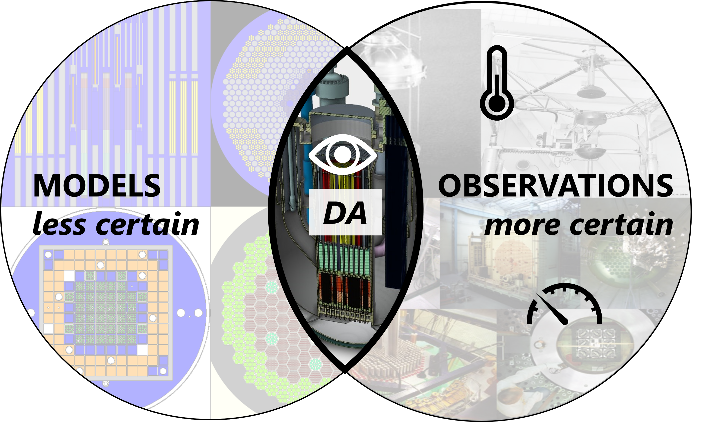

.. ANDALUS documentation master file, created by
   sphinx-quickstart on Sat Feb 28 17:38:22 2026.
   You can adapt this file completely to your liking, but it should at least
   contain the root `toctree` directive.

ANDALUS documentation
=====================

Applied Nuclear Data Assimilation using Least sqUareS (ANDALUS) is an Open Source data assimilation tool for improving predictions of nuclear applications.

.. toctree::
   :maxdepth: 2
   :caption: Contents:

   theory
   installation
   usage
   api/modules 