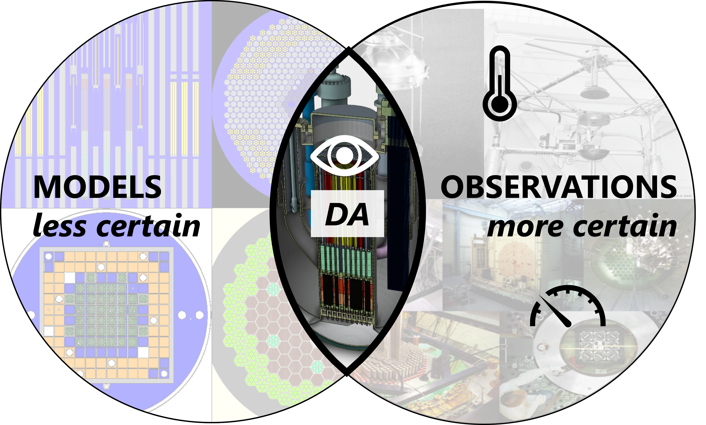

.. ANDALUS documentation master file

ANDALUS documentation
=====================

**Applied Nuclear Data Assimilation using Least sqUareS** (ANDALUS) is an open-source Python library
for improving predictions of nuclear systems through the generalized linear least squares (GLLS) method.
It combines integral benchmark experiments with nuclear data covariance information to produce adjusted,
physically consistent nuclear data that reduces calculation biases and uncertainties.

.. toctree::
   :maxdepth: 1
   :caption: Getting Started

   installation
   quickstart

.. toctree::
   :maxdepth: 1
   :caption: User Guide

   user_guide
   yaml_config
   theory

.. toctree::
   :maxdepth: 1
   :caption: Examples

   examples

.. toctree::
   :maxdepth: 1
   :caption: Reference

   api/modules
